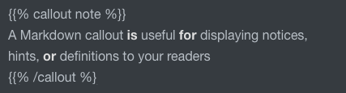
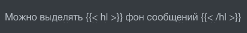

Чтобы выделить важный текст можно использовать **callout** **note** или callout warning

{} A Markdown callout **is** useful **for** displaying notices, hints, **or** definitions to your readers {

Можно выделять  фон сообщений 

